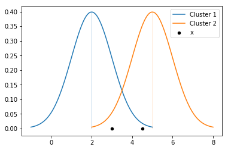

<h1>Expectation Maximization - A simple explanation of statistical inference using the example of a Gaussian Mixture Models</h1>

Clustering forms a group of unsupervised learning algorithms that are designed for finding unknown patterns in data. It is a fundamental part for many researches and practitioners working with data. K-Means is one of the best known and easiest clustering methods used today. The algorithm uses hard assignment to assign a data point to exactly one cluster. However, the lack of in-between assignment often leads to issues regarding overlapping clusters. 

In this article the Expectation Maximization algorithm is explained and discussed in simple words as a fundamental principal of statistical inference. Afterwards an implementation of the concept is presented in Python using the example of univariate Gaussian Mixture Models. The article is written for researchers and practitioners with a fundamental understanding of Machine Learning and Statistics.

<h2>Model</h2>
EM Clustering is a method to adress the issue of hard assignment. It adds the statistical assumption that every data point <i>xi</i> is randomly drawn from a distribution. In Gaussian Mixture Models the underlying assumption is a normal distribution. Therefore, every cluster <i>ki</i> out of <i>K</i> clusters equals a normal distribution with mean &mu;k. For simplicity the variance &sigma;2 is set to 1. Blei et al. (2016) formally write:

<i>K</i> is a hyperparameter of the model and determines the number of clusters which is fixed. A <b>hyperparameter</b> is a constant that has to be defined before inferring the model parameters. Usually a hyperparameter does not change during training. However, a <b>model parameter</b> is not known before. It has to be estimated during inference. In many cases model parameters are randomly initialized. <b>x</b> is the observed data which depends on cluster assignment <i>zi</i> and the mean &mu;. <b>&Phi;</b> is a <i>K</i> dimensional vector of a categorial distribution. It encodes the prior probability assumption that a data point <i>xi</i> was generated from a certain cluster <i>zi</i>. This is also a hyperparameter. For simplicity it is set to <i>&Phi;k = 1/K</i> for <i>k &isin; K</i>. 

<h2>EM Clustering</h2>

The algorithm optimizes the probability that every <i>xi</i> is assigned to cluster <i>zi</i> with a overall high likelihood of the model parameters given the observed data <i>p(&Phi;|x)</i>. A very important condition of the Expectation Maximization algorithm is that the <b>probability density function (pdf)</b> of the a posteriori distribution is known and available in closed form. This is one of many aspects that differentiates Expectation Maximization from Variational Inference. The probability density function of the posterior distribution in univariate Gaussian Mixture Models is the probability density function of the univariate normal distribution: 

Expectation Maximization computes a point estimate of the actual posterior distribution. However, the function that is optimized during inference is non-convex. The properties of a non-convex function let conclude that a found optimum is not guaranteed to be the global optimum. It learns a local optimal solution for the latent variables <b>z</b> and <b>&mu;</b> by using the observed variable <b>x</b>. The objective of the EM algorithm is to find a maximum likelihood estimate for the parameters of the model. In other words the algorithm finds a model parameter configuration the observed data was generated from very likely. 

<h3>E-Step</h3>
In the first step the probability for each data point <i>xi</i> and every possible cluster assignment is computed. 

In the numerator the prior expectation of the cluster assignment is multiplied by the density of the current selected cluster. The denominator is the normalization factor that simply computes the sum of densities over all possible cluster assignments <i>k</i> &isin; {1,...,K}. Therefore, the outcome of the normalized densities is a probability value between 0 and 1. It represents the probability that a data point <i>xi</i> is generated by cluster <i>k</i>. These probability values are computed for each data point and each possible cluster assignment. 

<h3>M-Step</h3>
In the next step the model parameters &mu; and &sigma; are updated. The prior expectation of the cluster assignment is usually fixed, but could also be updated by computing the average of each column in the table above.  

The updated value for &mu; is the weighted average of all data points <i>xi</i> that are assigned to cluster <i>k</i>. Similar the updated value for &sigma; is also computed by using the probabilities as weights.

<h2>Example</h2>
Let's assume we observe the data points x. We set <i>K</i>=2 with a prior cluster assignment &Phi;.
The initial values are:

The density for data point 1 is (assuming cluster 1 generated it):

The density for data point 1 is (assuming cluster 2 generated it):

Next step is to normalize the densities to compute the probability values (E-Step):

The probability that data point 1 was generated by cluster 1 is 83 percent whereas the probability that it was generated by cluster 2 is 17 percent. We also compute the probability values for data point 2:

The probability that data point 2 was generated by cluster 1 is 5 percent whereas the probability that it was generated by cluster 2 is 95 percent.

Last step is to update the model parameters (M-Step). These are the new estimates after the first iteration:

  

In practice both steps are repeated several times. It is guaranteed that the parameters converge to a stationary point. Let's evaluate the convergence of the model. Therefore, we compute the log likelihood before and after the first iteration:

It turns out that the likelihood is increasing. That means it is more likely that the estimated model after the first iteration has generated the observed data. Therefore, the algorithm works as expected and the model is getting better.

